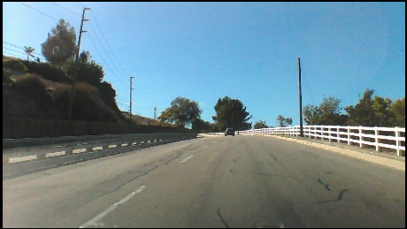

# Self Driving Car

Self driving car keras dave 2 CNN

 

# Summary

CNNs is widely using in self driving cars. Nvidia's Dave2, the model that using for autonome cars, one of the easiest way to build a Self driving car. In this project, we implement dave 2 to Keras and predict steering angle. 

# The Model

 

Dave-2 model using road images as inputs and predict the vehicle controls (steering angle) as outputs. You can look at full paper **[HERE](https://arxiv.org/pdf/1604.07316.pdf)**

# Dataset

 

Dataset consist of 45,406 images that get from a camcorder in real car ride. It made by Sully Chen. You can download **[HERE](https://drive.google.com/file/d/0B-KJCaaF7elleG1RbzVPZWV4Tlk/view)**. If you want to train your own model rather than using pretrained, just put the images to data/ folder.

# How To Run

You can either use pretrained model or train your own. 

Note: Because of the largeness of the dataset, you may need high compute resources for training.

To Train: 
 `python3 train.py`

To run test set: 
 `python3 run.py`

# Related Works -Source

-https://arxiv.org/pdf/1604.07316.pdf

-https://github.com/adityaguptai/Self-Driving-Car-

-https://github.com/tech-rules/DAVE2-Keras

